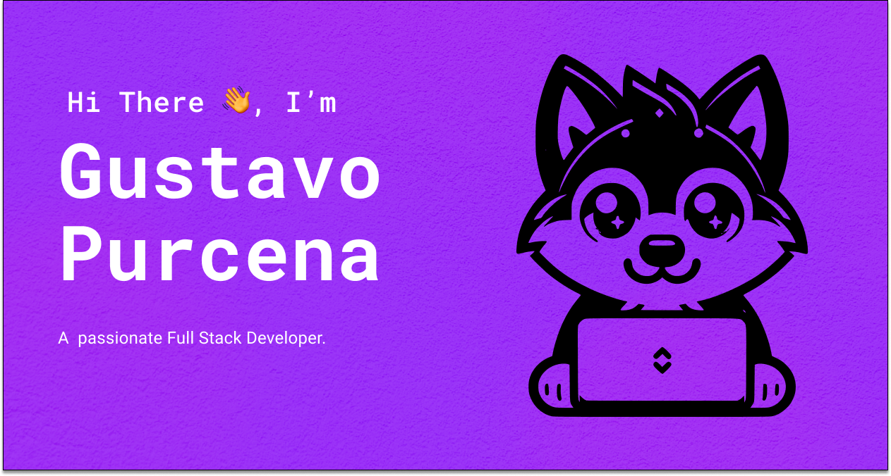

Proactive Mid Level Software Engineer with over 4 years of experience, always looking to learn more. Specializing in developing dynamic, responsive and acessible web platforms.  Committed to delivering high-quality user experiences and keeping up with tech trends.

### 🌐 Connect with me

### 📚  Languages

### 🔧 Frameworks, platforms, and libraries

### 📰 Databases

### 🔎 Testing

### 🔄 Version Control

### ✒️ Design

